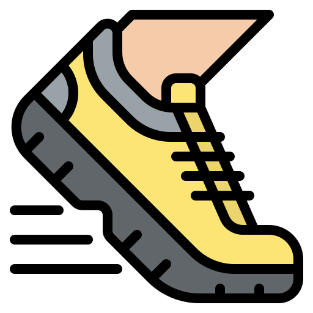
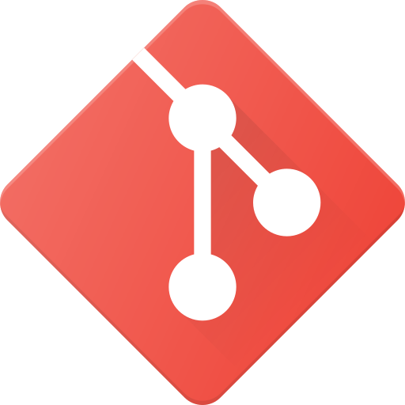

<h1 >Привет! Я Факир 
</h1>

**"Если достаточно долго мучить данные, они признаются в чем угодно."** - Рональд Коуз

##  Обо мне:
 Живу с Санкт-Петербурге                                                     
 Занимаюсь анализом данных 2 года                                              
 Увлекаюсь наукой                                        
 Каждый день очищаю кеш утренней пробежкой

##  Используемые инструменты:

|  |  |  |  |  | |  |  |
|------------|----------------|----------------|------------|-------------|---------|-------------|---------------------|
| **Python** | **PostgreSQL** | **ClickHouse** | **Redash** | **Jupyter** | **Git** | **Airflow** | **Yandex DataLens** |

 

